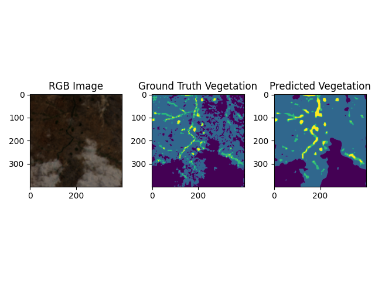
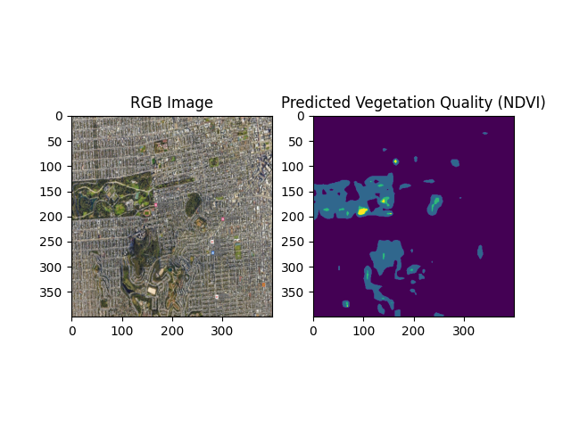
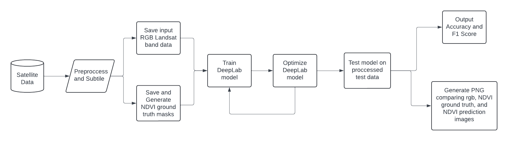

### Description

This project focuses on vegetation health classification using RGB images. Satellite data vegetation quality can be scored using NDVI formula. However, this requires the image to have the near infrared(NIR) band. Not all satellites and images have this band, so we are using machine learning to predict vegetation quality using the RGB bands of the images. The ground truths are still generated using the NDVI formula, however, the model only makes predictions using the RGB bands. This can help expand vegetation classification abilities to satelites that do not capture the NIR band.

### Examples 
<figure>
<figcaption>Landsat Tile Prediction:</figcaption>
  
</figure> 

<figure>
<figcaption>SF Prediction (Google Maps Screenshot):</figcaption>
  
  
</figure>

### ML Pipeline

### Models Tested & Accuracy (15 Epochs):
DeepLabv3 - 0.7350\
UNet - 0.7316\
FCNResnet101 - 0.5768\
SegmentationCNN -  0.7060

### Steps to run
**Setup and Training**
1. Download the cs175 electricity & settlement detection train dataset and place in the following file structure: **data/raw/Train/Tile*** 
2. Create and activate a Python virtual environment with python 3.12.3
3. <code> pip install -r requirements.txt </code>
4. If you are using a GPU (recommended), uninstall the torch package and install the torch package with the correct CUDA version.
5. Train the model using train.py
    - Common Parameters:
        - --model_type: Pick from "DeepLab", "UNet", "FCNResnetTransfer", "SegmentationCNN"
        - --max_epochs: Integer number of epochs to train
        - --device: "cpu" or "gpu"
        - --learning_rate: Float learning rate (default 0.001)
        - More parameters can be found in the train.py file
    - Example: <code> python -m scripts.train --model_type DeepLab --max_epochs 15 --device gpu</code>

**Testing, Predictions, and Evaluation**\
You can now either test the model against landsat data to see how it performs against true NDVI images or you can now make predicitions on custom RGB images.

**Landsat Data Testing: (Route 1)**

6. To evaluate and test on landsat data, download the cs175 electricity & settlement detection kaggle test dataset and place in the following file structure: **data/raw/Test/Tile***
7. Test and evaluate the model using test_data.py
    - Common Parameters:
        - --model_path: Path to the model file
        - --results_dir: Directory to save the results
    - Example: <code> python -m scripts.test_data --model_path models/DeepLab/last.ckpt --results_dir results</code>
8. The results directory will now have the plotted RGB, NDVI, and predicted NDVI images in a png for each tile in the test dataset.

**Custom RGB Image Predictions: (Route 2)**

6. Place custom RGB image anywhere in the directory
7. Make a prediction using custom_input_prediction.py
    - Parameters:
        - --model_path: Path to the model file
        - --image_path: Path to the custom RGB image
    - Example: <code> python -m src.visualization.custom_input_prediction --model_path models/DeepLab/last.ckpt --image_path data/custom/sf.jpg</code>
8. The root directory will now have the predicted NDVI image in a png format.

### Citing
If you use this repository, this is the citation: \
@misc{final-project-idk, \
  author = {Meghani, Krish and Thangellapally, Suraj and Kumar, Sree Santhosh and Arellano III, Samuel}, \
  title = {RGB NDVI Prediction}, \
  year = {2024}, \
  publisher = {GitHub}, \
  journal = {GitHub repository}, \
  howpublished = {\url{[https://github.com/username/repository](https://github.com/cs175cv-s2024/final-project-idk)}}, \
}

